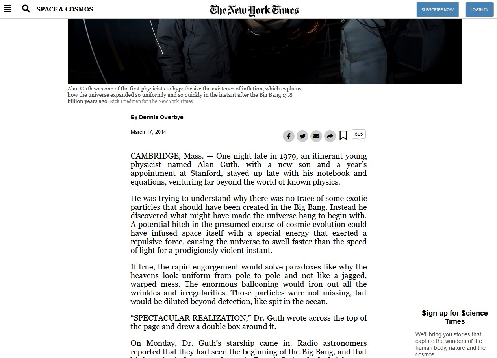

# Positioning and Floating Elements

> This is the third project of the Microverse Courses.

Replicating a New York Times article by using HTML & CSS.

## Built With

- HTML,
- CSS,

## GitHub Repo

- https://github.com/kbjude/new-york-times

## Authors

👤 **Eder Palmeros Gracia**

- Github: [@Eder-PG](https://github.com/Eder-PG)
- Twitter: [@eder_palmeros](https://twitter.com/eder_palmeros)
- Linkedin: [Eder Palmeros](https://www.linkedin.com/in/ederpg/)

👤 **Jude Kajura Balinda**

- Github: [@kbjude](https://github.com/kbjude)
- Linkedin: [Jude Kajura Balinda](www.linkedin.com/in/)

## Show your support

Give a ⭐️ if you like this project!

## Acknowledgments

- Microverse
- Our Families
- Everyone else

## 📝 License

Distributed under the MIT License. See `LICENSE` for more information.
